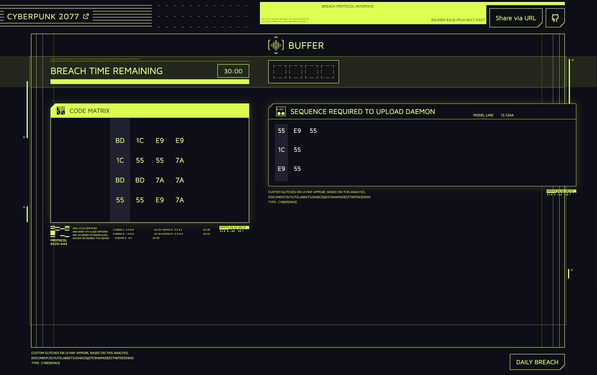

<h1 align="center">
  
 
Cyberpunk 2077 Breach Protocol

</h1>

### About
A fan recreation of the hacking mini-game "Breach Protocol" from [Cyberpunk 2077](https://www.cyberpunk.net).

You can play it [here](https://cyberpunk2077-breach-protocol.vercel.app/)

### Motivation
I'm a pretty big Cyberpunk fan (even if the game at launch was a mess of bugs), so when I was thinking about my next project, I wanted to make something in that cyberpunk aesthetic. The hacking mechanic was a perfect fit.

### Built with
- [pnpm](https://pnpm.io)
- [biome](https://biomejs.dev)
- [rsbuild](https://rsbuild.dev)
- [typescript](https://www.typescriptlang.org)
- [react](https://react.dev)
- [@tanstack/react-router](https://tanstack.com/router/latest/docs/framework/react/overview)
- [tailwindcss](https://tailwindcss.com)
- [zustand](https://github.com/pmndrs/zustand)
- [mutative](https://github.com/unadlib/mutative)

### TODO
- [ ] Add custom breach creator
- [ ] Add page background animation
- [ ] Add SFX maybe?

### Inspired by
- [Cyberpunk 2077](https://www.cyberpunk.net)
